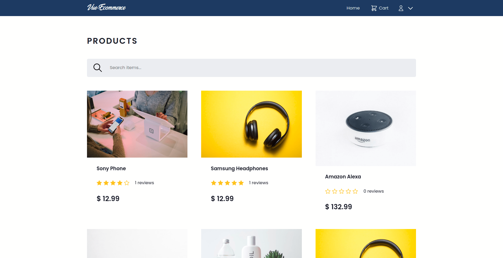

# vue-ecommerce

Flexible MEVN stack ecommerce setup.
Highly inspired by Brad Traversy's ProShop eCommerce Platform [ProShop](https://github.com/bradtraversy/proshop_mern)



## Features

-   Shopping cart
-   Product reviews
-   Pagination
-   Product search
-   Admin managment
-   Checkout process
-   Paypal integration

## Project setup

```
npm install
```

### Compiles and hot-reloads for development

```
npm run serve
```

### Compiles and minifies for production

```
npm run build
```

### Lints and fixes files

```
npm run lint
```
